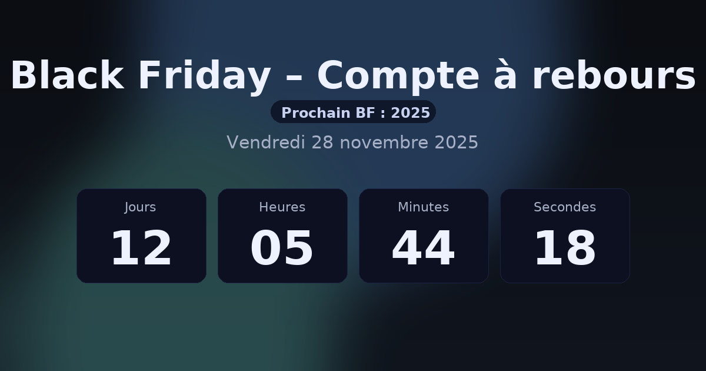

# Black Friday – Compte à rebours (auto)

Compte à rebours **responsive** vers le Black Friday, qui :
- calcule automatiquement la **date chaque année** (4ᵉ jeudi de novembre + 1 jour) ;
- affiche **Today** le jour J ;
- se **réinitialise automatiquement** dès le lendemain pour viser le prochain Black Friday ;
- propose deux actions utiles : **ajout au calendrier (.ics)** et **copie de la date**.

> 🔧 Deux modes dans ce repo :
> - `demo.html` : version **autonome** (tout en un, pratique pour aperçu rapide).
> - `index.html` + `assets/` : version **modulaire** (HTML / CSS / JS séparés).

---

## 👀 Aperçu

---

## 🗂 Arborescence

├─ index.html               # page principale (utilise assets/css + assets/js)
├─ demo.html                # version all-in-one pour tests rapides
├─ assets/
│  ├─ css/
│  │  └─ style.css         # styles 2025 (variables CSS, responsive)
│  └─ js/
│     └─ main.js           # logique du compte à rebours + .ics + copier la date
├─ .github/
│  └─ screenshot.png       # visuel pour le README
├─ README.md
└─ LICENSE

## 🚀 Déploiement (GitHub Pages)

1. Pousse ce repo sur GitHub.
2. **Settings → Pages** :
   - *Build and deployment* → **Deploy from a branch**
   - Branche : `main` (ou `master`)
   - Dossier : **/(root)** (ou `/docs` si tu déplaces les fichiers dans `docs/`)
3. Enregistre : GitHub génère l’URL publique.
4. Ouvre l’URL : `index.html` sera servi automatiquement.  
   *(Tu peux aussi accéder directement à `demo.html` si besoin.)*

---

## 🧠 Fonctionnement

- **Calcul de date** : on détermine Thanksgiving (4ᵉ jeudi de novembre), puis **+1 jour** = Black Friday.
- **États** :
  - *Avant* : compteur **Jours/Heures/Minutes/Secondes** jusqu’au début du jour J (00:00 locale).
  - *Aujourd’hui* : affichette **Today**, le compteur disparaît.
  - *Après* : la cible bascule sur **l’année suivante**.
- **Fuseau** : s’appuie sur l’heure locale du navigateur.
- **Accessibilité** : régions ARIA et `aria-live` pour annoncer les changements.

---

## 🧩 Personnalisation

- Couleurs & ambiance : variables CSS en tête de `style.css` (`--bg`, `--accent`, etc.).
- Typo : police système par défaut ; tu peux intégrer une police web si tu le souhaites.
- Boutons :
  - `.ics` : crée un rendez-vous **journée entière** (DTSTART/DTEND en local → format `VALUE=DATE`).
  - **Copier la date** : met la date longue (locale FR) dans le presse-papiers.

---

## ✅ Compatibilité

- Navigateurs modernes (Chromium, Firefox, Safari) 📱💻
- Pas de dépendances, pas de build : **HTML/CSS/JS vanilla**.

---

## 🧪 Tests rapides

- Change l’horloge système pour simuler *avant / jour J / après*.
- Vérifie que :
  - le label **Today** apparaît le jour J ;
  - le **.ics** se télécharge et s’importe correctement dans ton agenda ;
  - la **copie de date** affiche un toast “Date copiée…” puis revient à l’état normal.

---

## 📄 Licence

Ce projet est sous licence **MIT** — voir [`LICENSE`](./LICENSE).

---

## 💡 To the moon
Devenez, comme [BlackFridayFrance.com](https://blackfridayfrance.com/), le meilleur site de votre catégorie.

## ✨ Crédits

© Ce tool est proposé par **Black Friday France (blackfridayfrance.com)**.  
